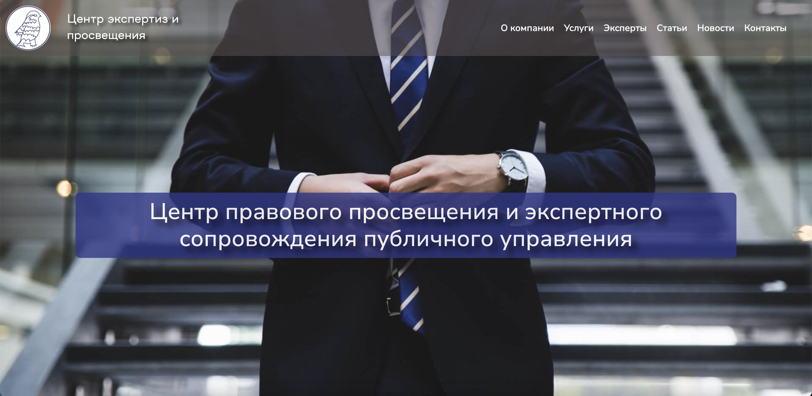

## [Посмотреть на сайт](https://hbtch.github.io/Law-firm/)
<h3 align="center">Сайт для юридической компании</h3>

## Используемые технологии

- Анимация при помощи CSS и библиотеки Bootstrap (бургер-меню, карусель),
- Сетки flex и grid,
- Препроцессоры sass,
- Псевдоклассы и псевдоэлементы,
- Адаптивный и резиновый дизайн (AWD, RWD).
